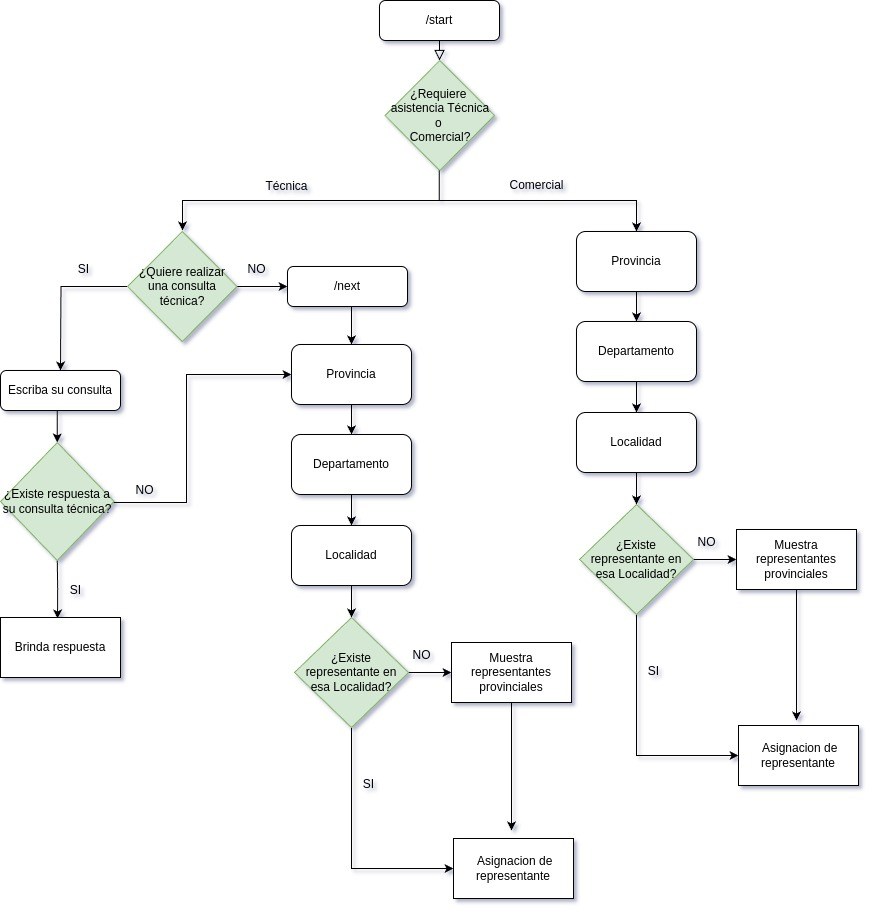

# NLP Project: Chatbot de Asistencia al Cliente

## Tabla de contenidos
- [Introducción](#introducción)
- [Características](#características)
- [Configuración](#configuración)
- [Uso](#uso)
- [Datos](#datos)
- [Modelo](#modelo)
- [Resultados](#resultados)
- [Propuestas](#propuestas)


---

## Introducción
Este proyecto involucra el desarrollo de un chatbot para una gran empresa agroquímica con el fin de gestionar consultas de clientes de manera eficiente. El chatbot aborda dos tipos de consultas:

1. **Consultas Técnicas**: Proporciona la opción de enviar una pregunta a un bot especializado para asistencia detallada.
2. **Consultas Comerciales**: Dirige a los usuarios al contacto adecuado para preguntas relacionadas con ventas.

En ambos casos, el chatbot recopila la provincia, departamento y localidad del usuario para recomendar el contacto más adecuado.

---

## Características
- Gestiona dos tipos distintos de consultas: técnicas y comerciales.
- Las consultas técnicas se procesan utilizando un pipeline de RAG (Retrieval-Augmented Generation) para proporcionar respuestas precisas y contextualizadas.
- Las consultas comerciales guían al usuario hacia el contacto más relevante según su ubicación.
- Incorpora un modelo LLM liviano para generar respuestas en lenguaje natural.

---

## Configuración

### Requisitos
- Python 3.x
- PyTorch
- Hugging Face Transformers
- Pandas
- Dependencias adicionales listadas en `requirements.txt`

### Instalación

Antes de correr el setup.py es fundamental tener instalado pytorch con la correcta compatiblidad con el driver de cuda - si esta disponible.
Se recomienda crear un virtual environment, clonar el repositorio y luego instalar los paquetes requeridos:

```bash
# Virtual environment
virtualenv env_name
source env_name/bin/activate

# Clonar el repositorio
git clone https://github.com/FrankAst/CA_chatbot.git
cd CA_chatbot

# Ejecute por unica vez:
chmod +x setup.py

# Luego ejecute el siguiente archivo bash para correr el pipeline:
python3 setup.py
```

---

## Uso

Ejecuta el chatbot con el siguiente comando:

```bash
python3 bot_core.py
```

El chatbot guiará al usuario a través del proceso de consulta, solicitando la información necesaria (por ejemplo, ubicación) y gestionando las consultas de manera adecuada.
Para iniciar el bot en Telegram el usuario debe tipear /start. 

### Diagrama de Aplicación


### Flujo de Ejemplo
1. **Consulta Técnica**:
   - El usuario selecciona "Consulta Técnica".
   - El chatbot pregunta si desea enviar una pregunta al bot.
   - La consulta se procesa, se compara con la base de conocimientos y se pasa al LLM para una respuesta detallada.
   - La respuesta generada se presenta al usuario.

2. **Consulta Comercial**:
   - El usuario selecciona "Consulta Comercial".
   - El chatbot recopila detalles de la ubicación del usuario (provincia, departamento, localidad).
   - Se recupera y comparte el mejor contacto con el usuario.


---

## Datos
Los archivos de datos incluidos en el proyecto son:
- **details.xlsx**: Contiene información de áreas de operación y contacto de los representantes DTM y RTV. Este archivo se divide en dos nuevos archivos:
   - **merged_DTM.csv**: Creado con `preprocessing.ipynb`.
   - **merged_RTV.csv**: Creado con `preprocessing.ipynb`.
- **productos.csv**: Contiene información sobre pesticidas y otros productos para control de plagas. Después de su transformación, alimenta al RAG.

Además:
- **data_validation**: Script que valida la entrada del usuario cuando se le solicita provincia, localidad, etc.
- **provinciamascercana.py**: Detecta a qué provincia se refiere el usuario en caso de errores tipográficos.

---

## Modelo
El proyecto utiliza un enfoque RAG (Retrieval-Augmented Generation):

1. **Vectorización**:
   - Se utiliza **distiluse-base-multilingual-cased-v1** para vectorizar los datos y compararlos con las consultas del usuario mediante similitud coseno.
   
2. **Generación**:
   - El modelo **DeepESP/gpt2-spanish** genera respuestas en lenguaje natural basadas en los datos recuperados y el prompt proporcionado.

---

# Resultados y Propuestas de Mejora

## Resultados

El chatbot agiliza las interacciones con los clientes al:

* Identificar con precisión la intención del usuario (técnica o comercial).
* Proporcionar respuestas precisas y contextualizadas para consultas técnicas.
* Redirigir a los usuarios al contacto adecuado para consultas comerciales.

### Métricas de rendimiento

* La precisión de las respuestas generadas con la técnica RAG todavía necesitan un mayor grado de refinamiento. A su vez, la calidad de las respuestas que se obtienen con el LLM necesitan acotarse.
* El LLM continúa presentando alucinaciones frente a ciertas preguntas.

---

## Propuestas

* Refinar la búsqueda por distancias entre vectores.
* Introducir el reconocimiento de entidades para disminuir ambigüedad.
* Permitir una conversación continua con el usuario, utilizando una mayor ventana de memoria.
* Pre clasificar preguntas para acotar el espacio de búsqueda del RAG.
---


**Autores:** Astegiano Franco, Cicconi Carlos, Fierro Abel, Saldaña Gustavo
**Licencia:** [MIT License]
